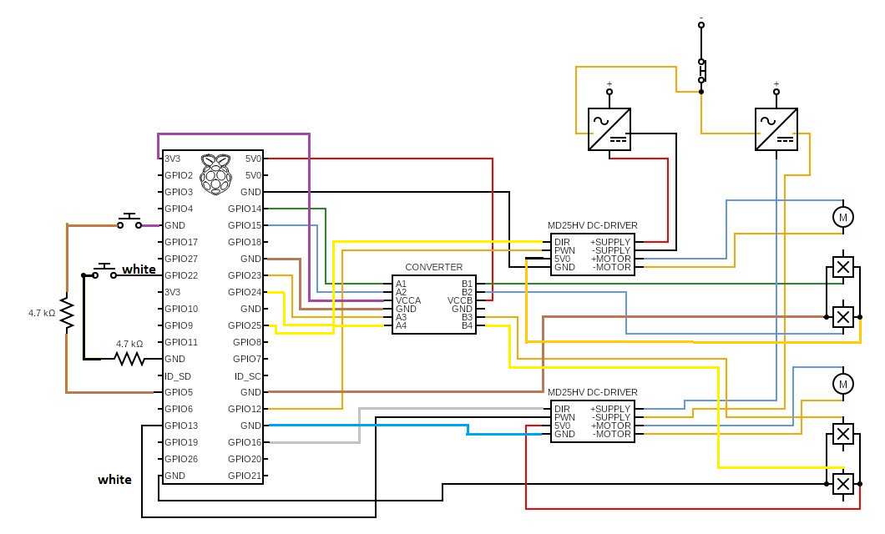

# astrolab

ROS2 package which provides the webserver (UI), arm, table and (limited 3D) visualizer nodes, a limited digital twin implementation of the Physical Sun Simulators behaviour, and the connections to the Physical Sunlight Simulator. Note that the following guides were written for Ubuntu 22.04 and has been extended for Ubuntu 24.04.

## Table of Contents

- [How to install](#how-to-install)
- [How to run the package](#how-to-run-the-package)
- [How to set up rqt for execution diagnostics](#how-to-set-up-rqt-for-execution-diagnostics)
- [How to set up rqt for connection diagnostics](#how-to-set-up-rqt-for-connection-diagnostics)
- [Other options to control the Physical Sun Simulator](#other-options-to-control-the-physical-sun-simulator)

## How to install

1. Install ROS2 Iron Irwini as described [here](https://docs.ros.org/en/iron/Installation/Ubuntu-Install-Debians.html) (and for Ubuntu 24.04: [here](https://docs.ros.org/en/jazzy/Installation/Ubuntu-Install-Debians.html)).
2. Setup your (bash) terminal environment for ROS2:

```bash
echo "source /opt/ros/iron/setup.bash" >> ~/.bashrc
echo "export ROS_DOMAIN_ID=8" >> ~/.bashrc
```

and for Ubuntu 24.04:

```bash
echo "source /opt/ros/jazzy/setup.bash" >> ~/.bashrc
echo "export ROS_DOMAIN_ID=8" >> ~/.bashrc
```

3. Install colcon:

```bash
sudo apt install python3-colcon-common-extensions
```

4. Install tf2 and rviz dependencies:

```bash
sudo apt-get install ros-iron-rviz2 ros-iron-tf2-ros ros-iron-tf2-tools
```

and for Ubuntu 24.04:

```bash
sudo apt-get install ros-jazzy-rviz2 ros-jazzy-tf2-ros ros-jazzy-tf2-tools
```

5. Make a ROS2 workspace somewhere in your filesystem:

```bash
mkdir -p ros2_ws/src
```

6. Navigate to `ros2_ws`:

```bash
cd ros2_ws
```

7. Make a virtual environment:

```bash
python3 -m venv venv
```

8. Generate the requirements:

```bash
echo "action-msgs==1.6.0
action-tutorials-interfaces==0.27.1
action-tutorials-py==0.27.1
actionlib-msgs==5.0.1
actuator-msgs==0.0.1
ament-cmake-test==2.0.5
ament-copyright==0.14.3
ament-cppcheck==0.14.3
ament-cpplint==0.14.3
ament-flake8==0.14.3
ament-index-python==1.5.2
ament-lint==0.14.3
ament-lint-cmake==0.14.3
ament-package==0.15.3
ament-pep257==0.14.3
ament-uncrustify==0.14.3
ament-xmllint==0.14.3
angles==1.16.0
blinker==1.8.2
builtin-interfaces==1.6.0
catkin-pkg==1.0.0
click==8.1.7
composition-interfaces==1.6.0
control-msgs==5.2.0
controller-manager==3.25.0
controller-manager-msgs==3.25.0
cv-bridge==3.5.0
demo-nodes-py==0.27.1
diagnostic-msgs==5.0.1
diagnostic-updater==3.1.2
docutils==0.21.2
domain-coordinator==0.11.2
example-interfaces==0.10.2
examples-rclpy-executors==0.18.0
examples-rclpy-minimal-action-client==0.18.0
examples-rclpy-minimal-action-server==0.18.0
examples-rclpy-minimal-client==0.18.0
examples-rclpy-minimal-publisher==0.18.0
examples-rclpy-minimal-service==0.18.0
examples-rclpy-minimal-subscriber==0.18.0
Flask==3.0.3
geometry-msgs==5.0.1
image-geometry==3.5.0
interactive-markers==2.4.0
itsdangerous==2.2.0
Jinja2==3.1.4
joint-state-publisher==2.4.0
joint-state-publisher-gui==2.4.0
laser-geometry==2.5.0
launch==2.0.3
launch-ros==0.24.1
launch-testing==2.0.3
launch-testing-ros==0.24.1
launch-xml==2.0.3
launch-yaml==2.0.3
lifecycle-msgs==1.6.0
logging-demo==0.27.1
map-msgs==2.2.0
MarkupSafe==2.1.5
message-filters==4.7.0
nav-msgs==5.0.1
numpy==1.26.4
osrf-pycommon==2.1.2
pcl-msgs==1.0.0
pendulum-msgs==0.27.1
pyparsing==3.1.2
python-dateutil==2.9.0.post0
python-qt-binding==1.2.4
PyYAML==6.0.1
qt-dotgraph==2.4.3
qt-gui==2.4.3
qt-gui-cpp==2.4.3
qt-gui-py-common==2.4.3
quality-of-service-demo-py==0.27.1
rcl-interfaces==1.6.0
rclpy==4.1.5
rcutils==6.2.3
resource-retriever==3.2.2
rmw-dds-common==2.0.1
ros-gz-interfaces==0.254.1
ros-image-to-qimage==0.4.1
ros2action==0.25.6
ros2bag==0.22.6
ros2bag-mcap-cli==0.22.6
ros2bag-sqlite3-cli==0.22.6
ros2cli==0.25.6
ros2component==0.25.6
ros2doctor==0.25.6
ros2interface==0.25.6
ros2launch==0.24.1
ros2lifecycle==0.25.6
ros2multicast==0.25.6
ros2node==0.25.6
ros2param==0.25.6
ros2pkg==0.25.6
ros2run==0.25.6
ros2service==0.25.6
ros2topic==0.25.6
rosbag2-interfaces==0.22.6
rosbag2-py==0.22.6
rosgraph-msgs==1.6.0
rosidl-adapter==4.0.1
rosidl-cli==4.0.1
rosidl-cmake==4.0.1
rosidl-generator-c==4.0.1
rosidl-generator-cpp==4.0.1
rosidl-generator-py==0.18.0
rosidl-generator-type-description==4.0.1
rosidl-parser==4.0.1
rosidl-pycommon==4.0.1
rosidl-runtime-py==0.12.0
rosidl-typesupport-c==3.0.1
rosidl-typesupport-cpp==3.0.1
rosidl-typesupport-fastrtps-c==3.0.2
rosidl-typesupport-fastrtps-cpp==3.0.2
rosidl-typesupport-introspection-c==4.0.1
rosidl-typesupport-introspection-cpp==4.0.1
rpyutils==0.3.2
rqt==1.3.4
rqt-action==2.1.2
rqt-bag==1.3.4
rqt-bag-plugins==1.3.4
rqt-console==2.1.1
rqt-controller-manager==3.25.0
rqt-gauges==0.0.3
rqt-graph==1.4.2
rqt-gui==1.3.4
rqt-gui-py==1.3.4
rqt-joint-trajectory-controller==3.24.0
rqt-moveit==1.0.1
rqt-msg==1.3.1
rqt-plot==1.2.3
rqt-publisher==1.6.3
rqt-py-common==1.3.4
rqt-py-console==1.1.1
rqt-reconfigure==1.3.4
rqt-robot-dashboard==0.5.8
rqt-robot-monitor==1.0.6
rqt-robot-steering==1.0.0
rqt-runtime-monitor==1.0.0
rqt-service-caller==1.1.1
rqt-shell==1.1.1
rqt-srv==1.1.1
rqt-tf-tree==1.0.4
rqt-topic==1.6.1
sensor-msgs==5.0.1
sensor-msgs-py==5.0.1
service-msgs==1.6.0
shape-msgs==5.0.1
six==1.16.0
sros2==0.11.3
statistics-msgs==1.6.0
std-msgs==5.0.1
std-srvs==5.0.1
stereo-msgs==5.0.1
sun_position @ git+https://github.com/Physical-Sun-Simulator/sun_position.git@d0bdd9fcc4fde44a1e253f8e41abdd2c20214e5d
teleop-twist-keyboard==2.4.0
tf2-geometry-msgs==0.31.7
tf2-kdl==0.31.7
tf2-msgs==0.31.7
tf2-py==0.31.7
tf2-ros-py==0.31.7
tf2-sensor-msgs==0.31.7
tf2-tools==0.31.7
theora-image-transport==3.1.0
topic-monitor==0.27.1
trajectory-msgs==5.0.1
turtle-tf2-py==0.3.6
turtlesim==1.6.1
type-description-interfaces==1.6.0
unique-identifier-msgs==2.3.2
vision-msgs==4.1.1
visualization-msgs==5.0.1
Werkzeug==3.0.3
xacro==2.0.9" >> requirements.txt
```

9. Install the requirements:

```bash
pip install -r requirements.txt
```

10. Navigate to the src directory:

```bash
cd src
```

11. Clone the astrolab repository in the src directory:

```bash
git clone https://github.com/Physical-Sun-Simulator/astrolab
```

12. Clone the simulation_interfaces repository in the src directory:

```bash
git clone https://github.com/Physical-Sun-Simulator/simulation_interfaces
```

13. Return to the `ros2_ws` directory.

```bash
cd ..
```

14. Start the virtual environments:

```bash
source install/setup.bash
source venv/bin/activate
```

15. Build the packages (and make sure that there are no significant errors: it prints `Summary: 2 packages finished`):

```bash
colcon build
```

## How to run the package

1. Navigate to the workspace directory in the terminal
2. Start the virtual environments:

```bash
source install/setup.bash
source venv/bin/activate
```

3. Build the packages (and make sure that there are no significant errors: it prints `Summary: 2 packages finished`):

```bash
colcon build
```

4. Run the code:

With (limited 3D) visualization:

```bash
ros2 launch astrolab simulation_launch.py
```

Without visualization:

```bash
ros2 launch astrolab demo_launch.py
```

Launching individual nodes:

- user interface node:

```bash
ros2 run astrolab user_interface
```

- arm node:

```bash
ros2 run astrolab arm
```

- table node:

```bash
ros2 run astrolab table
```

- visualization node:

```bash
ros2 run astrolab visualization
```

- state_publisher node:

```bash
ros2 run astrolab state_publisher
```

5. Open `127.0.0.1:5000` in a webbrowser.

## How to set up rqt for execution diagnostics

1. Make sure that you have installed rqt, the required plugins and its dependencies:

```bash
sudo apt update
sudo apt install '~nros-iron-rqt*'
```

and for Ubuntu 24.04:

```bash
sudo apt update
sudo apt install '~nros-jazzy-rqt*'
```

2. Start the bash virtual environment in the workspace directory:

```bash
source install/setup.bash
```

3. Start rqt:

```bash
rqt
```

4. In the Perspectives tab click on import and select `Diagnostics - 1.perspective` in the `src/astrolab/rqt_perspectives` folder.
5. In the top-left most component (Console) click on Fit Columns.
6. In the component on its right (Rotational) fill in `/arm_angle_topic/data` in the Topic textfield, click on "Subscribe" and fill in 90 in the Max Value textfield. This component fill show the current rotation of the arm.
7. In the component on its right (Bar) fill in `/arm_speed_service/data` in the Topic textfield, click on "Subscribe", fill in 100 in the Max Value textfield and fill in 0 in the Min Value textfield. This component fill show the current rotation speed of the arm.
8. In the component on its right (Rotational) fill in `/table_angle_topic/data` in the Topic textfield, click on "Subscribe" and fill in 360 in the Max Value textfield. This component fill show the current rotation of the table.
9. In the component on its right (Bar) fill in `/table_speed_service/data` in the Topic textfield, click on "Subscribe", fill in 100 in the Max Value textfield and fill in 0 in the Min Value textfield. This component fill show the current rotation speed of the table.
10. In the down-left most component (Service Caller) set the Service dropdown to `/arm_speed_service`. This component allow the user to change the rotational speed of the arm. Additionally, by changing the service to `/arm_initialize_service` the user can choose to initialize the arm (reset to start position).
11. In the down-right most component (Service Caller) set the Service dropdown to `/table_speed_service`. This component allow the user to change the rotational speed of the table. Additionally, by changing the service to `/table_initialize_service` the user can choose to initialize the table (reset to start position).

## How to set up rqt for connection diagnostics

1. Make sure that you have installed rqt, the required plugins and its dependencies:

```bash
sudo apt update
sudo apt install '~nros-iron-rqt*'
```

and for Ubuntu 24.04:

```bash
sudo apt update
sudo apt install '~nros-jazzy-rqt*'
```

2. Start the bash virtual environment in the workspace directory:

```bash
source install/setup.bash
```

3. Start rqt:

```bash
rqt
```

4. In the Perspectives tab click on import and select `Diagnostics - 2.perspective` in the `src/astrolab/rqt_perspectives` folder.

## Other options to control the Physical Sun simulator

- See [kinematics](https://github.com/Physical-Sun-Simulator/kinematics) for a simple control script.
- Use the pin scheme below and control the machine yourself using [gpiozero](https://pypi.org/project/gpiozero/) or [libgpio](https://github.com/brgl/libgpiod)


